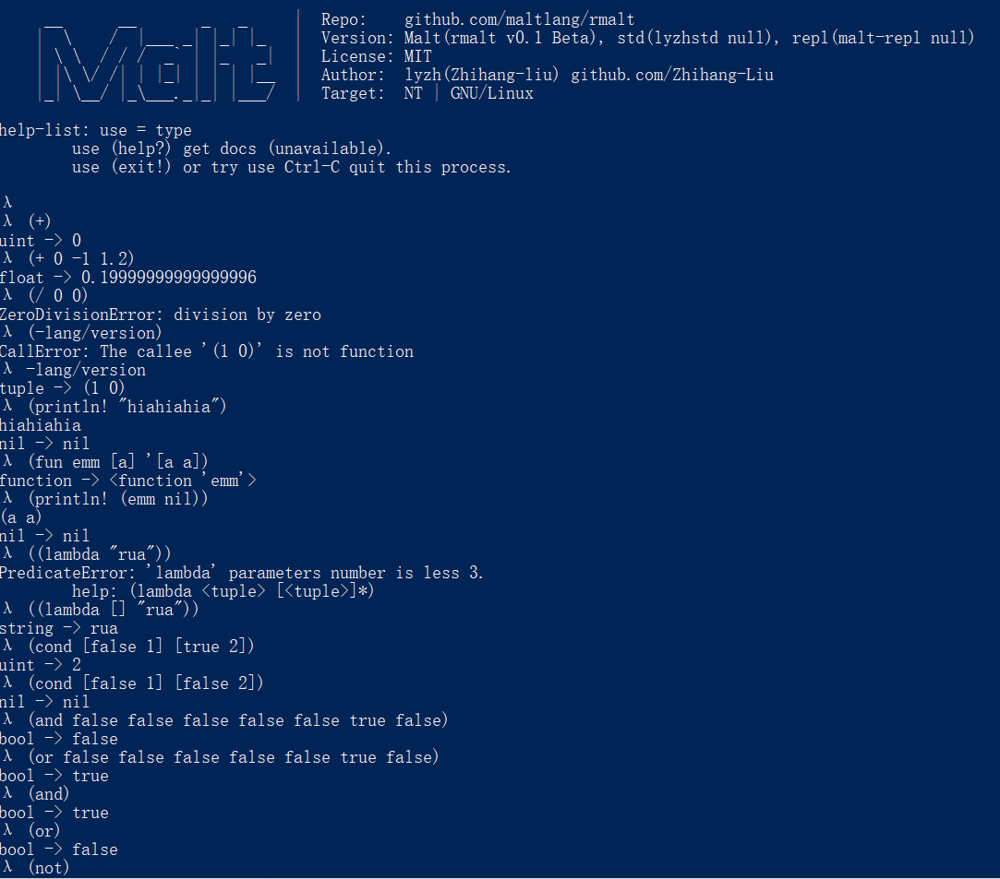

<h1 align="center">
  <a href="https://github.com/maltlang/rmalt"> 
  <a href="https://github.com/maltlang/rmalt">Malt</a>
</h1>

<h4 align="center">The rust implementation of malt programming language</h4>

---

## 计划表
- [ ] Init function
- [ ] Common path system
- [ ] module load funstions
- [ ] Pattern matching
- [ ] More prelude functions

## BaseType
- Nil
- Bool
- Int
- UInt
- Float
- Symbol
- String
- Tuple
- Dict
- Object
- Function
- Module

***注意：前面不加符号表示无符号整数，加符号表示有符号整数，浮点数除外***

## Demo

**repl没有认真写，所以只能读一行（Parser是能做多行的，但我输入直接用的.read_line）**
